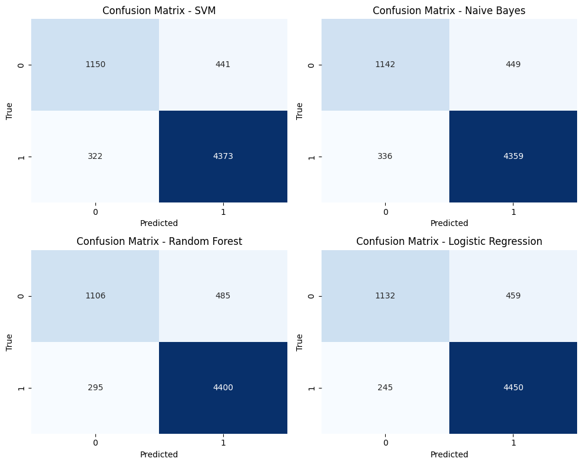
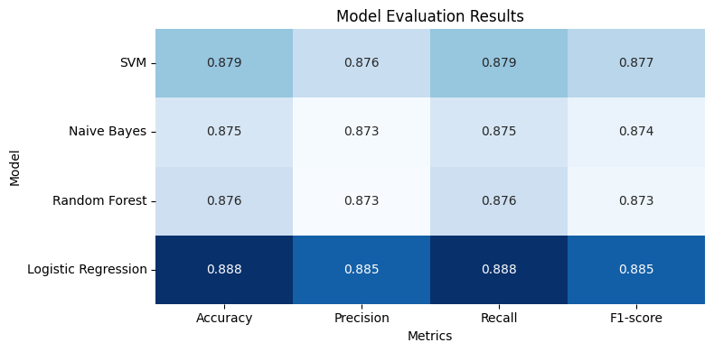

## Note
- The goal of this project is not to try to build the best model or optimize for application in real problems, instead we focus on practice data and feature analysis, and try over methods like process NLP, tokenize, embed, feature selection, classic ML models, and then try state-of-the-art method in NLP like transformer. What we'd all done at this time is implement with some classic ML models.
- U can read details in temp_pipeline or demo_pipeline file.

## Result
Input: >31k review records (e-commerce).   
Label: neg/neu/pos.   
Result:

Evaluation (im missing the std values):

## Overall workflow

## Comparation tasks
There's options to implement in other ways to get insights which method will fit problem.
- [ ] Try feature select with adj POS.
- [ ] Try use RNN, LSTM, GRU methods.
- [ ] Try combine with embed method and transformer for Vietnamese like PhoBert.